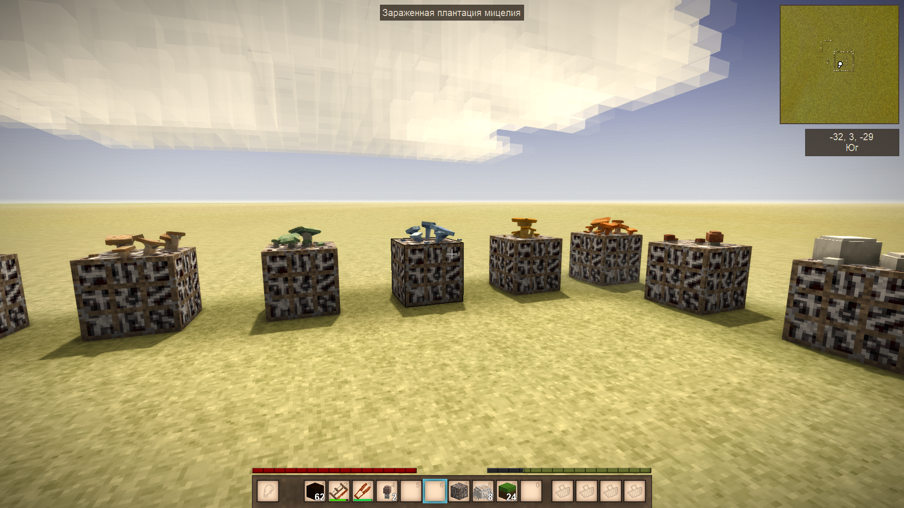
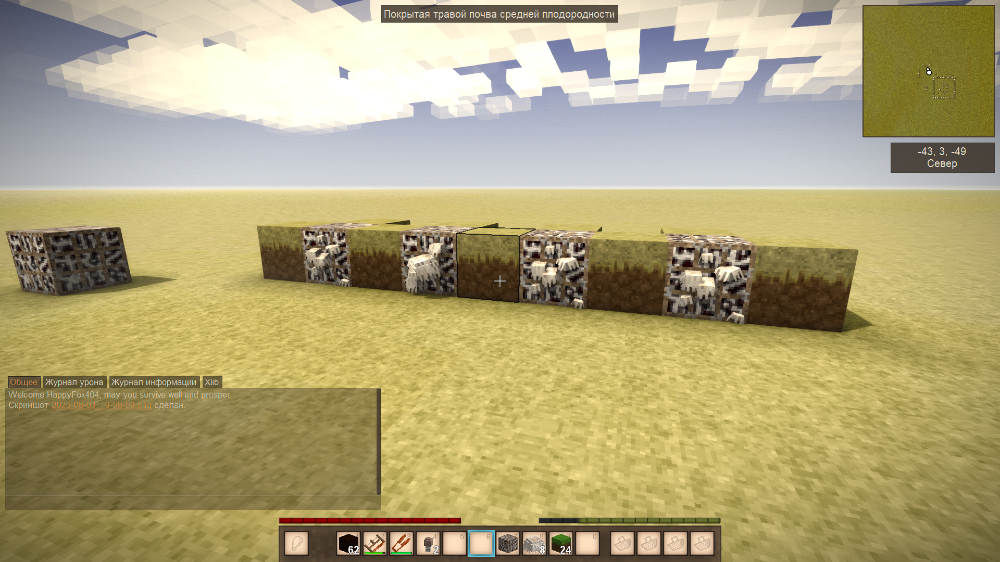

# HappyPack

## Описание 

Мод добавляет различные блоки, вещи и т.д. На текщий момент содержит 1 вещь

Добавляет в игру плантацию мицелия, которая позволяет выращивать любые виды грибов. Поддерживает грибы, которые растут как на змеле так и на деревяьх. Время роста варьируется от 2 до 4 дней.

## Конфигурация
Вы можете изменить время роста ростений через конфигурационный файл, время указывается в секундах: (1 день в Vintage Story равен 48 минутам)
```json
{
  "MaxWaitSeconds": 11520,
  "MinWaitSeconds": 5760
}
```

## Использование

В игре вам потребуется скрафтить плантацию мицелия, после чего Вы можете расположить её в мире, следующим Вам потребуется заселить плантацию мциелия спорами кого-либо гриба. Достаточно просто щёлкнуть правой кнопкой мыши по гребу, после чего вы получите зараженную плантацию мицелия. Далее через определенный промежуток времени (а также при необходимых температурных условиях) Вы увидите гриб, либо сверху, либо на одной из сторон. Важно на 1 плантации может расти, только 1 гриб и пока Вы его не собирете второй гриб не сможет вырасти.

## Скриншоты

Пример грибов растущих на земле:

Пример грибов растущих на деревьях:
